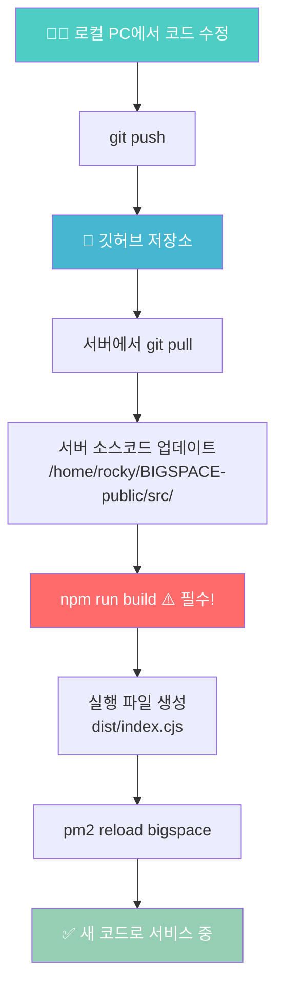
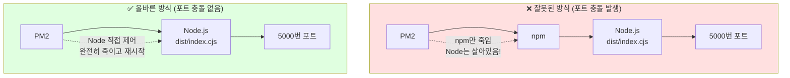
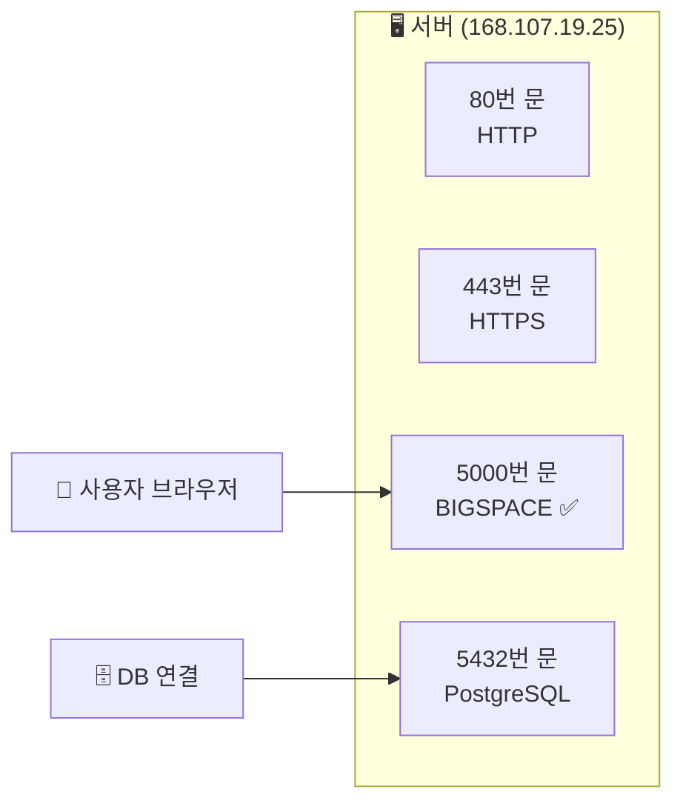
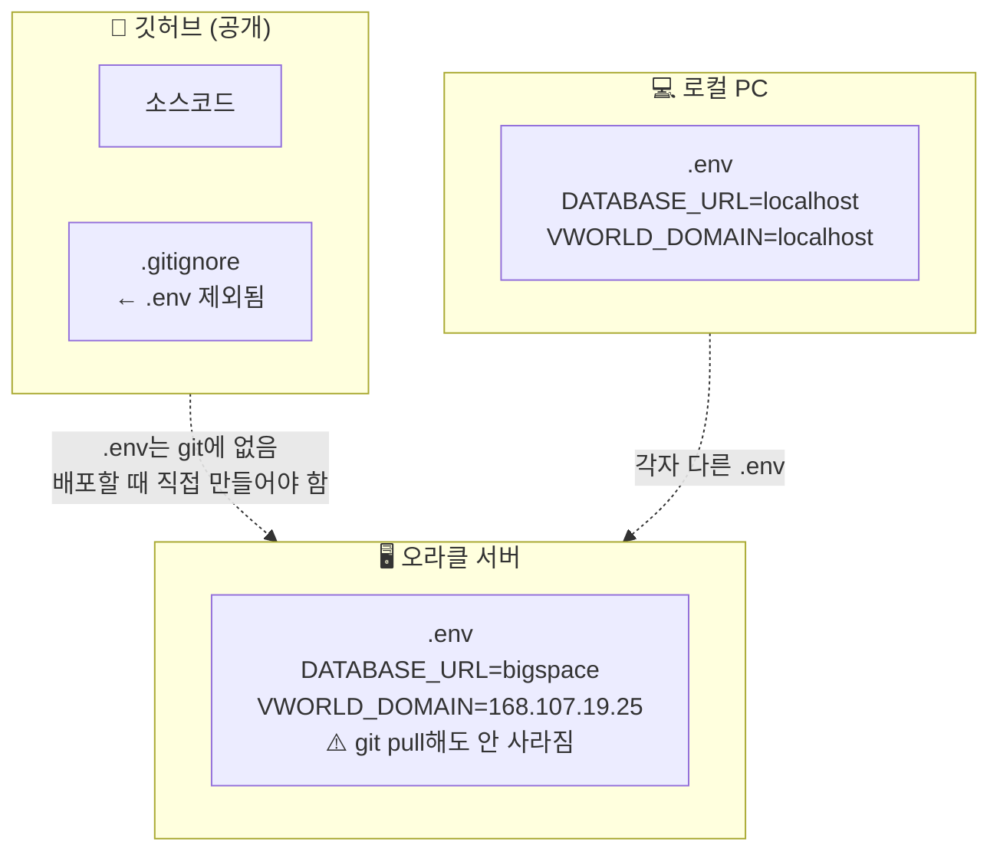
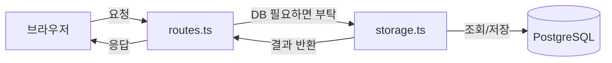

# BIGSPACE 서버 구조 이해

## 1. 코드 배포 흐름



---

## 2. 서버에서 프로세스 구조



**올바른 실행 명령어:**
```bash
pm2 delete bigspace
pm2 start dist/index.cjs --name bigspace
pm2 save
```

---

## 3. 포트란?



- 한 포트에는 **하나의 프로세스만** 연결 가능
- 이미 사용 중인 포트에 새 프로세스가 붙으려 하면 → **EADDRINUSE 오류**

---

## 4. .env 위치



---

## 5. 코드 역할 분리 규칙

### routes.ts vs storage.ts



| 파일 | 역할 | 비유 |
|------|------|------|
| `routes.ts` | 요청 받고 → 적절한 담당자한테 넘기기 | 안내데스크 |
| `storage.ts` | DB에서 데이터 꺼내오거나 저장 | DB 담당 직원 |

### 왜 이걸 지켜야 하나

코드는 어디서든 `import { pool } from "./db"` 한 줄만 쓰면 **routes.ts에서도 DB 직접 접근이 가능**합니다. 막는 장치가 없어요.

그래서 **규칙을 사람이 직접 정해야** 합니다:

- ✅ 새 쿼리는 반드시 `storage.ts`에 메서드로 추가
- ✅ `routes.ts`는 `storage.XXX()` 호출만
- ❌ `routes.ts`에서 `pool.query()` 또는 `db.execute()` 직접 사용 금지

> 현재 `routes.ts`에 `pool.query` 직접 사용이 12곳 남아있음 (점진적으로 정리 예정)

---

## 6. 서버 업데이트 체크리스트

```
□ ssh rocky@168.107.19.25 접속
□ cd ~/BIGSPACE-public
□ git checkout -- package-lock.json
□ git pull
□ npm install
□ npm run build          ← 절대 빠뜨리지 말 것!
□ pm2 reload bigspace
□ pm2 logs bigspace --lines 5 --nostream  ← 정상 확인
```
